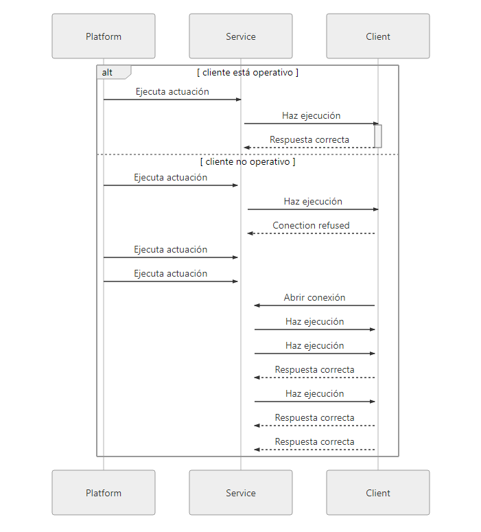

# Action Module 
[Getting Started](https://github.com/flythings/python)

### Index
* [Action Data Types](#action_types)
* [Register Action](#register_action)
* [Register Action Series](#register_action_series)
* [Start Action Listening](#start_action_listening)
* [Stop Action Listening](#stop_action_listening)

## Action Types
- <a name="action_types"></a>**ActionDataTypes**  
**Description**: Enumerated withe the allowed datatypes for the callbacks of the actions.  
**Values**:  
	- **ActionDataTypes.BOOLEAN**: The callback will receive a boolean value from the server when the action is triggered.  
	- **ActionDataTypes.FILE**: The callback will receive a string representing the url where the file is when the action is triggered.  
	- **ActionDataTypes.NUMBER**: The callback will receive a number from the server when the action is triggered.  
	- **ActionDataTypes.TEXT**: The callback will receive a string from the server when the action is triggered.  
	- **ActionDataTypes.ARRAY**: The callback will receive a string array from the server when the action is triggered.  
	- **ActionDataTypes.DATE**: The callback will receive a string date from the server when the action is triggered.  
	- **ActionDataTypes.SELECTOR**: The callback will receive a string value with the selected option value from the server when the action is triggered.  
	- **ActionDataTypes.JSON**: The callback will receive a string json from the server when the action is triggered.  
	- **ActionDataTypes.LIVE**: The callback will receive a string with the seriesId from the server when the action is triggered.  
    
## Module Methods 

- <a name="register_action"></a>**registerAction**(String name, Function callback, String foi, ActionDataTypes parameterType, String alias)  
    **Description**: registers an action with the server, when the action is later run by the web client the callback is executed.  
    **Params**:  
    - name: (Mandatory) Identifier of the action.  
    - callback: (Mandatory) Function that executes when the action is triggered. The function must return a 0 to indicate that was executed propertly or a string to indicate there was a error.   
    That function must receive 2 params, the first one the value of the action and the second one the timestamp of the action.       
    - foi:  (Optional, Default configuration foi) This parameter is optional if it was already set with the setDevice method otherwise is mandatory.  
    - parameterType: (Optional, Default: None) Specifies the parameter type of the callback if any.   
    - alias: (Optional) Specifies a alias to the action.    
    - action_options: (Optional) Specifies the options of a selector action on format ({name:?, value:?}).    
    
    **Return**: True if all was correct, otherwise False.    
    ```NoAuthenticationError```  
    ```NoDeviceError```  
    ```NoProcedureError```  
    **Examples**:  
    * Register an action with the server.  
    ```PYTHON
        import flythings as fly
        fly.login("<your username>","<your password>", "<login type>")
        def test(param,timestamp):
          print(param)
          print(timestamp)
        fly.registerAction("<name>", test, foi="<device>", parameterType=fly.ActionDataTypes.TEXT)
    ```

- <a name="register_action_series"></a>**registerActionForSeries**(String name, String observableProperty, String unit, Function callback, String foi, String procedure, ActionDataTypes parameterType, String alias)  
    **Description**: registers an action with the server, when the action is later run by the web client the callback is executed.  
    **Params**:  
    - name: (Mandatory) Identifier of the action.  
    - observableProperty: (Mandatory) Observable property of the series.  
    - unit: (Mandatory) Unit property of the series.  
    - callback: (Mandatory) Function that executes when the action is triggered. That function must receive 2 params, the first one the value of the action and the second one the timestamp of the action. The function should return:
        - 0, '0', True, 'True' to indicate that the execution goes well.
        - A string to indicate that there was an error executing.
        - A object with a field code with values equals to 0, '0', True, 'True' to indicate that the execution goes well, anything else indicates that there was a error, and any attribute you want to persist on the log.  
        For example: {'code': "0", 'message':"All Ok"}  
    - foi: (Optional) This parameter is optional if it was already set with the setDevice method otherwise is mandatory.
    - procedure: (Optional) This parameter is optional if it was already set with the setProcedure method otherwise is mandatory.  
    - parameterType: (Optional, Default: None) Specifies the parameter type of the callback if any.  
    - alias: (Optional) Specifies a alias to the action.
    - action_options: (Optional) Specifies the options of a selector action on format ({name:?, value:?}).    

    **Return**: True if all was correct, otherwise False.    
    ```NoAuthenticationError```    
    ```NoDeviceError```  
    ```NoProcedureError```  
    **Examples**:  
    * Registers an action with the server.  
    ```PYTHON
        import flythings as fly
        fly.login("<your username>","<your password>", "<login type>")
        def test(param,timestamp):
          print(param)
          print(timestamp)
        fly.registerActionForSeries("<name>","<observableProperty", "<unit>", test, foi="<device>", procedure="<procedure>", parameterType=fly.ActionDataTypes.TEXT, alias="test_alias")
    ```

- <a name="start_action_listening"></a>**startActionListening**()  
    **Description**: Starts listening to the server waiting for an action to trigger. Is necessary that at least one action is registered.  
    **Return**: None  
    ```NoDeviceException```  
    ```NoRegisteredActionExcetion```  
    **Examples**:  
    * Starts listening waiting for an action to trigger.  
    ```PYTHON
        import flythings as fly
        import time
        fly.login("<your username>","<your password>", "<login type>")
        def test(param,timestamp):
          print(param)
          print(timestamp)
        fly.registerAction("<name>", test, foi="<device>", parameterType=fly.ActionDataTypes.TEXT)
        fly.startActionListening()
        while(True):
            print("listening...")
            time.sleep(10)
    ```

- <a name="stop_action_listening"></a>**stopActionListening**()  
    **Description**: Stop listening to the server for actions.  
    **Return**: None.  
    ```NoAuthenticationError```    
    ```NoDeviceError```    
    ```NoProcedureError```   
    **Examples**:  
    * Stop listening to the server for actions.  
    ```PYTHON
        import flythings as fly, time
        fly.login("<your username>","<your password>", "<login type>")
        listening = False
        def test(param,timestamp):
          print(param)
          print(timestamp)
          fly.stopActionListening() #Stops listening when a action was triggered
          listening = False
        fly.registerAction("<name>", test, foi="<device>", parameterType=fly.ActionDataTypes.TEXT)
        fly.startActionListening()
        listening = True
        while(listening):
            print("listening...")
            time.sleep(10)
    ```  
    
## Sequence Diagram 



## [License](LICENSE)
**Developed by [ITG](http://www.itg.es)**
