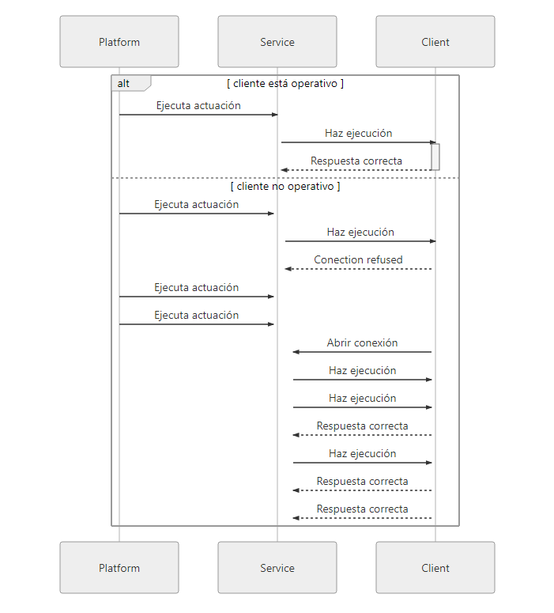

# ActionsApi

[Back to the README](../README.md) · [Client, connections and series](Client.md)

Registers device actions and runs their callbacks when the platform triggers them. Get it with `client.actions_api(device=None)`; the device defaults to the client's. Each call returns a new API with its own registered actions, so keep the one you register on to start listening.

## Methods

| Method | Description |
| --- | --- |
| `register_action(name, callback, foi=None, parameter_type=None, alias=None, action_options=None, json_template=None)` | Registers an action of the device on the server, and the callback that runs it. For a `SELECTOR` action, `action_options` is a list of `ActionOption` dicts: `{"name": <shown to users>, "value": <sent to the device>}`. |
| `register_action_for_series(name, observable_property, unit, callback, foi=None, procedure=None, parameter_type=None, alias=None, action_options=None, json_template=None)` | Registers an action attached to a series. `procedure` defaults to the client's sensor; `unit` may be `None`. |
| `start_listening(foi=None)` | Opens the action socket in a background thread. As in 2.x, the thread keeps the program running until `stop_listening()` or `close()` is called, so a script can end right after `start_listening()` and keep serving actions. It reconnects every `retry_interval` seconds (30 by default) after a failure, including a message it cannot read. Raises `FlyThingsError` while a previous listener is still finishing a callback after `stop_listening()`. |
| `stop_listening(timeout=None)` | Stops the listener and closes the socket, waiting up to `timeout` seconds for a running callback to finish. It can be called from an action callback (as can `close()`); the listener then ends when the callback returns. |
| `send_progress(message)` | Reports progress of the running action. |
| `close()` / `with` block | Same as `stop_listening()`. `FlyThings.close()` does this for every actions API it created. |

Registering the same name twice raises `ValueError`; server errors raise `ApiError`. `action_options` applies only to `SELECTOR` actions. `parameter_type` takes an `ActionDataTypes` member or its name.

## Callbacks

The callback is called with as many of these arguments as it accepts: `()`, `(param)`, `(param, timestamp)` or `(param, timestamp, action_log)`. Returning `0` or a string sends it back to the server as the result; an exception is logged and reported as an empty result. A parameter that cannot be converted to its type is passed as `None`.

| `ActionDataTypes` | `param` received |
| --- | --- |
| `BOOLEAN` | `bool` |
| `NUMBER` | `int` or `float` |
| `ARRAY` | `list[str]` |
| `TEXT`, `DATE`, `SELECTOR`, `JSON`, `LIVE` | The value as received, normally a `str` (for `LIVE`, the series ID; for `SELECTOR`, the selected option) |
| `FILE` | The value as received, normally a `str` with the URL of the file |
| none | `None` |

## Example

```python
import time

from flythings import ActionDataTypes


def reboot(confirm: bool) -> int:
    if confirm:
        schedule_reboot()
    return 0


with client.actions_api(device="<device>") as actions:
    actions.register_action("Reboot", reboot, parameter_type=ActionDataTypes.BOOLEAN)
    actions.start_listening()
    time.sleep(3600)
```

Leaving the `with` block stops the listener. Without it, the listener keeps the program running after the last line of the script, as in 2.x:

```python
actions = client.actions_api(device="<device>")
actions.register_action("Reboot", reboot, parameter_type=ActionDataTypes.BOOLEAN)
actions.start_listening()  # serves actions until the process is stopped
```

## Sequence diagram


